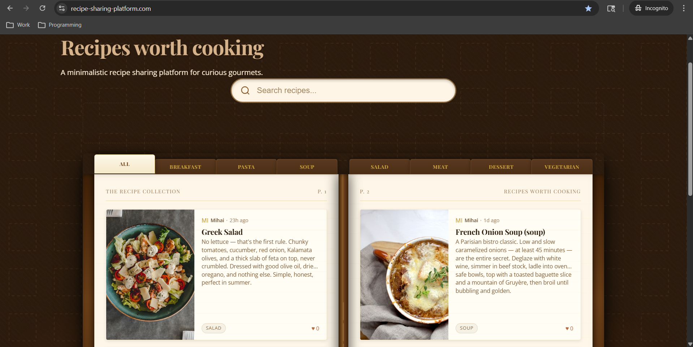

# 🍄 Recipe Sharing Platform

A full-stack recipe sharing application built with a hobbit-pantry aesthetic. Users can browse recipes, create accounts, post their own recipes with images, like and favourite dishes, and manage their profile — all backed by a production-deployed REST API.



---

## Live Architecture

```
┌─────────────────────────────────────────────────────────────┐
│                        Browser                              │
│                   Vue 3 SPA (Vite)                          │
└───────────────────────┬─────────────────────────────────────┘
                        │ HTTPS / JSON + FormData
                        ▼
┌─────────────────────────────────────────────────────────────┐
│              Laravel 11 REST API (Railway)                  │
│        Sanctum token auth · RecipeResource · Gates         │
└────────────┬────────────────────────┬───────────────────────┘
             │                        │
             ▼                        ▼
┌────────────────────┐    ┌───────────────────────────────────┐
│  MySQL (Railway)   │    │  Cloudflare R2 Object Storage     │
│  recipes, users,   │    │  recipe images (public bucket)    │
│  likes, favourites │    │  served via public R2 URL         │
└────────────────────┘    └───────────────────────────────────┘
```

---

## Tech Stack

### Frontend
| Technology | Role |
|---|---|
| Vue 3 (Composition API) | UI framework |
| Vite | Build tool and dev server |
| Vue Router 4 | Client-side routing with navigation guards |
| Pinia | Global state management |
| `useForm` composable | Form validation with cross-field rules |
| `useTimeAgo` composable | Relative timestamps |

### Backend
| Technology | Role |
|---|---|
| Laravel 11 | REST API framework |
| Laravel Sanctum | Token-based API authentication |
| Eloquent ORM | Database models and relationships |
| Form Requests | Validation layer (`StoreRecipeRequest`, `UpdateRecipeRequest`) |
| API Resources | Response shaping (`RecipeResource`) |
| Gates & Policies | Ownership-based authorization |
| Flysystem S3 | Cloud file storage abstraction |

### Infrastructure
| Service | Role |
|---|---|
| Railway | API hosting and MySQL database |
| Cloudflare R2 | S3-compatible object storage for images |
| Vite build | Static frontend (deployable to any CDN) |

---

## Features

### Authentication
- Register with name, email, password, and password confirmation
- Login with email and password returning a Sanctum Bearer token
- Token persisted in `localStorage` and attached to all authenticated requests via `Authorization: Bearer` header
- Logout invalidates the server-side token
- Navigation guards redirect unauthenticated users away from protected routes and guests away from guest-only routes

### Recipe Feed
- Public feed of all recipes, visible without an account
- Each card shows: recipe image (or category emoji placeholder), title, author avatar and name, relative timestamp, like count, category tag, and difficulty badge
- Category emoji placeholders: breakfast 🍳, pasta 🍝, soup 🍲, salad 🥗, meat 🥩, dessert 🍰, vegetarian 🥦

### Recipe Detail
- Full recipe view with image, description, ingredients table, and numbered steps
- Prep time and cook time display
- Like toggle (heart) — authenticated users only, reflects real-time count
- Favourite toggle (star) — authenticated users only
- Owner-only controls: **Edit recipe** (gold button) and **Delete recipe** (with confirmation modal)

### Add Recipe
- Full form with: title, description, category (8 options), difficulty (easy / medium / hard), prep time, cook time, dynamic ingredient rows (name + amount), dynamic step rows
- Image upload via click-to-upload area with live preview and remove button
- Image sent as `multipart/form-data` with nested array keys (`ingredients[0][name]`, `steps[0]`, etc.)
- Client-side validation via `useForm` composable before any API call is made

### Edit Recipe
- Pre-fills all fields from the existing recipe on load
- Image section has three states: view current image, replace with new upload, or remove entirely
- Only changed fields need to be sent — backend uses `sometimes` validation rules
- Redirects to recipe detail on successful save
- Only accessible by the recipe owner (enforced by Laravel Gate on the backend)

### Profile Page
- Two tabs: **My Recipes** and **Favourites**
- My Recipes: filtered list of all recipes authored by the logged-in user, with inline delete button and confirmation modal
- Favourites: all recipes the user has starred, loaded in parallel on mount
- Both tabs show empty states when no content exists

### UX Details
- Custom parchment-style confirmation modal (used for all delete actions) with smooth scale+fade transition and backdrop click to dismiss
- Scroll-to-top button appears after scrolling 300px on any page, fixed bottom-right, fades in and out
- Loading and error states on all data-fetching views
- All API errors surface inline above the relevant form

---

## API Reference

### Auth (public)
```
POST   /api/auth/register
POST   /api/auth/login
POST   /api/auth/logout        (authenticated)
GET    /api/auth/me            (authenticated)
```

### Recipes (public read, authenticated write)
```
GET    /api/recipes                  list all recipes
GET    /api/recipes/{id}             single recipe detail
POST   /api/recipes                  create recipe (multipart/form-data)
POST   /api/recipes/{id}             update recipe (multipart/form-data)
DELETE /api/recipes/{id}             delete recipe
```

### Social
```
POST   /api/recipes/{id}/like        toggle like
POST   /api/recipes/{id}/favourite   toggle favourite
GET    /api/favourites               list authenticated user's favourites
```

### Profile
```
GET    /api/profile                  authenticated user profile
POST   /api/profile                  update profile (multipart for avatar)
GET    /api/users/{id}               public profile
```

### RecipeResource shape
```json
{
  "id": 1,
  "title": "Bœuf Bourguignon",
  "description": "...",
  "category": "meat",
  "difficulty": "hard",
  "prep_time": 45,
  "cook_time": 180,
  "ingredients": [{ "name": "beef chuck", "amount": "1500g" }],
  "steps": ["Pat beef dry...", "Sear in batches..."],
  "image_url": "https://pub-xxx.r2.dev/recipes/abc.jpg",
  "likes_count": 12,
  "created_at": "2026-03-13T14:29:31.000000Z",
  "author": { "id": 1, "name": "Mihai", "avatar": null },
  "is_liked": true,
  "is_favourited": false,
  "is_owner": true
}
```

---

## Project Structure

### Frontend (`src/`)
```
src/
├── assets/
│   └── main.css              # CSS variables, global styles, hobbit theme
├── components/
│   ├── AppNav.vue             # Navigation bar
│   ├── RecipeCard.vue         # Feed card with image/placeholder, meta, likes
│   ├── ConfirmModal.vue       # Reusable parchment-style delete modal
│   └── ScrollToTop.vue        # Fixed scroll-up button, appears after 300px
├── composables/
│   ├── useForm.js             # Reactive form state, validation, touched tracking
│   └── useTimeAgo.js          # Human-readable relative timestamps
├── router/
│   └── index.js               # Routes with requiresAuth and guestOnly guards
├── services/
│   └── api.js                 # Fetch wrapper, Bearer token injection, all endpoints
├── stores/
│   ├── auth.js                # Login, register, logout, session persistence
│   └── recipes.js             # Fetch, create, update, delete, like, favourite
└── views/
    ├── HomeView.vue            # Public recipe feed
    ├── RecipeDetailView.vue    # Full recipe, like/favourite/edit/delete
    ├── AddRecipeView.vue       # Create recipe form
    ├── EditRecipeView.vue      # Edit recipe form (pre-filled)
    ├── ProfileView.vue         # My Recipes + Favourites tabs
    ├── LoginView.vue           # Login / Register tabs
    └── NotFoundView.vue        # 404
```

### Backend (`app/`)
```
app/
├── Http/
│   ├── Controllers/Api/
│   │   ├── AuthController.php        # register, login, logout, me
│   │   ├── RecipeController.php      # index, show, store, update, destroy
│   │   ├── LikeController.php        # toggle like
│   │   ├── FavouriteController.php   # toggle favourite, index
│   │   └── ProfileController.php     # show, update, showPublic
│   ├── Requests/
│   │   ├── StoreRecipeRequest.php    # required fields + image validation
│   │   └── UpdateRecipeRequest.php   # all fields optional (sometimes)
│   └── Resources/
│       └── RecipeResource.php        # shapes response, computes is_liked/is_owner
├── Models/
│   ├── User.php                      # hasMany recipes, belongsToMany likes/favourites
│   └── Recipe.php                    # belongsTo user, json casts, scopes
└── Policies/
    └── RecipePolicy.php              # update/delete gates check user_id ownership
```

---

## Key Design Decisions

**Token auth over sessions** — Sanctum Bearer tokens are used instead of cookie/session auth. This avoids CSRF complexity for cross-origin API calls and works cleanly with any future mobile client.

**POST for multipart updates** — Browsers cannot send `FormData` via `PUT`. The update endpoint is defined as `POST /api/recipes/{id}` on the backend, avoiding the need for `_method` field spoofing.

**`sometimes` validation on update** — The `UpdateRecipeRequest` uses `sometimes` on all fields, so the frontend only sends what has actually changed rather than the entire recipe payload every time.

**Auth-aware public routes** — `GET /api/recipes` and `GET /api/recipes/{id}` are public but still return `is_liked`, `is_favourited`, and `is_owner` correctly for authenticated users, achieved by calling `auth()->shouldUse('sanctum')` at the top of those controller methods.

**Cloudflare R2 for images** — R2 is S3-compatible, free for moderate traffic, and has no egress fees. Images are stored under a `recipes/` prefix with a public bucket URL configured via `AWS_PUBLIC_URL` in Railway environment variables.

**Composable-first frontend** — All form logic lives in `useForm.js`, keeping views thin. The composable supports cross-field validators (e.g. `password_confirmation`) by passing the full values object as a second argument to each rule function.

---

## Environment Variables

### Laravel (Railway)
```env
APP_KEY=
APP_URL=https://your-api.railway.app

DB_CONNECTION=mysql
DB_HOST=
DB_PORT=3306
DB_DATABASE=
DB_USERNAME=
DB_PASSWORD=

SANCTUM_STATEFUL_DOMAINS=your-frontend.com

AWS_ACCESS_KEY_ID=
AWS_SECRET_ACCESS_KEY=
AWS_DEFAULT_REGION=auto
AWS_BUCKET=recipe-sharing-platform-api
AWS_ENDPOINT=https://<account_id>.r2.cloudflarestorage.com
AWS_PUBLIC_URL=https://pub-xxxx.r2.dev

SESSION_DRIVER=array
```

### Vue (`.env`)
```env
VITE_API_BASE_URL=https://your-api.railway.app/api
```

---

## Local Development

```bash
# Frontend
npm install
npm run dev

# Backend
composer install
cp .env.example .env
php artisan key:generate
php artisan migrate --seed
php artisan serve
```
